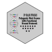

## PRSFNN



PRSFNN (Polygenic Risk Score with Functional Neural Networks) is a Julia module for calculating polygenic risk scores by integrating GWAS summary statistics with functional annotations using neural networks.

## Features

- Integration of GWAS summary statistics with functional annotations
- Linkage disequilibrium (LD) calculation and correction
- Coordinate Ascent Variational Inference (CAVI) for posterior effect size estimation
- Neural network models to learn the relationship between functional annotations and genetic effect sizes

## PRSFNN runner

Note: this Julia module is used for running PRSFNN in individual LD blocks and training the neural network. To run PRSFNN genome-wide is an HPC environment, see our workflow [here](https://github.com/weinstockj/PRSFNN-runner). 

## Installation

```julia
# From the Julia REPL
using Pkg
Pkg.add(url="https://github.com/weinstockj/PRS.jl")
```

## Getting Started

Steps to load this module from the root directory:

1. Run `julia --color=yes --project=.` (requires Julia 1.9.0 or later)
2. Run `using Revise` # helpful while developing
3. Run `using PRSFNN`

Now the functions have been loaded. 
To call an internal function, use `PRSFNN.function_name` 

To run Julia in debugger mode: `JULIA_DEBUG=PRSFNN julia --color=yes --project=.`

## Usage

### Basic Example

```julia
using PRSFNN

# Run PRSFNN on a genomic region
result = main(
    output_prefix = "chr3_block1",
    annot_data_path = "path/to/annotations.parquet", 
    gwas_data_path = "path/to/gwas_stats.tsv",
    ld_panel_path = "path/to/ld_panel"
)
```

### Simulating GWAS Data

For testing and development, you can simulate GWAS summary statistic data:

```julia
# Generate simulated data
raw = simulate_raw(;N = 10_000, P = 1_000, K = 100, h2 = 0.10)
# Extract sufficient statistics needed for PRS
summary_stats = estimate_sufficient_statistics(raw.X, raw.Y)

```

### Training a PRS Model

```julia
# Train the PRS model
N = size(raw.X, 1)  # Number of samples
P = size(raw.X, 2)  # Number of SNPs
XtX = construct_XtX(summary_stats.R, ones(P), N)
D = construct_D(XtX)
Xty = construct_Xty(summary_stats.coef, D)

σ2, R2, yty = infer_σ2(
    summary_stats.coef, 
    summary_stats.SE, 
    XtX, 
    Xty, 
    N, 
    P; 
    estimate = true, 
    λ = 0.50 * N
)

K = size(raw.G, 2)
H = 5  # Number of hidden units

layer_1 = Dense(K => H, Flux.softplus; init = Flux.glorot_normal(gain = 0.005))
layer_output = Dense(H => 2)
layer_output.bias .= [StatsFuns.log(0.001), StatsFuns.logit(0.1)]
model = Chain(layer_1, layer_output)
initial_lr = 0.00005
optim_type = AdamW(initial_lr)
opt = Flux.setup(optim_type, model)

PRS = train_until_convergence(
    summary_stats.coef,
    summary_stats.SE,
    summary_stats.R, 
    XtX,
    Xty,
    raw.G,
    model = model,
    opt = opt,
    σ2 = σ2,
    R2 = R2,
    yty = yty,
    N = fill(N, P),  # Vector of sample sizes
    train_nn = false,
    max_iter = 5
)
```
## Documentation

For more detailed documentation, visit the [official documentation site](https://weinstockj.github.io/PRS/dev).

## Running the Tests

Run unit tests with:

```julia
julia --project=. test/runtests.jl
```

or interactively with:

```julia
includet("test/runtests.jl")
```

## Contact

Please address correspondence to:
- Josh Weinstock <josh.weinstock@emory.edu>
- April Kim <aprilkim@jhu.edu>
- Alexis Battle <ajbattle@jhu.edu>

## Functions

```@docs
PRSFNN.main
PRSFNN.rss 
PRSFNN.elbo
PRSFNN.joint_log_prob
PRSFNN.train_until_convergence
PRSFNN.fit_heritability_nn
PRSFNN.log_prior
PRSFNN.estimate_sufficient_statistics
PRSFNN.compute_LD
PRSFNN.fit_genome_wide_nn
PRSFNN.train_cavi
PRSFNN.simulate_raw
PRSFNN.infer_σ2
PRSFNN.poet_cov
```
